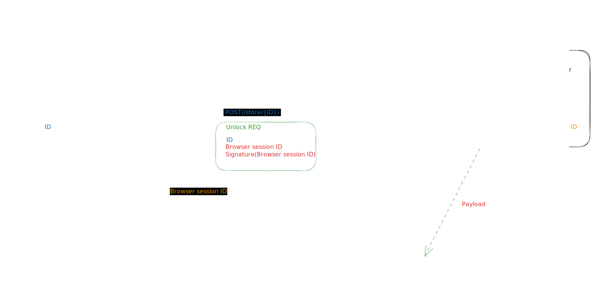

# Pass-it

### Pass your payload securely between two clients via remote server

This project aims to prepare server for passing payload between two clients with confirmation receiver's credentials by sender.

Below is a ideation of the message flow:

### How to run
1. Run server from `server/pass-it.go` file.
2. To simulate mobile client, run `tools/crypto.go`.
  1. It first generates key pair and prints encoded public key to be used as `key` parameter in **Store** request.
  2. Then it waits for `browser session id` sent by server in **Fetch** stream initial event to be entered by user in console.
  3. Then it generates `signature` for **Confirm** request.
3. To simulate browser client, use Postman or similar Server Sent Events client to connect to `http://localhost:8080/fetch` endpoint.

#### Known issues:
- [ ] Sending confirmation with wrong signature will purge the key from cache and client cannot retry operation
